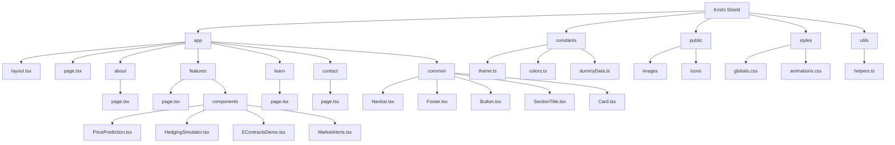

```mermaid
graph TB
    A[Krishi Shield] --> B[app]
    A --> C[constants]
    A --> D[public]
    A --> E[styles]
    A --> F[utils]
    
    B --> B1[layout.tsx]
    B --> B2[page.tsx]
    B --> B3[about]
    B --> B4[features]
    B --> B5[learn]
    B --> B6[contact]
    B --> B7[common]
    
    B3 --> B31[page.tsx]
    B4 --> B41[page.tsx]
    B4 --> B42[components]
    B5 --> B51[page.tsx]
    B6 --> B61[page.tsx]
    B7 --> B71[Navbar.tsx]
    B7 --> B72[Footer.tsx]
    B7 --> B73[Button.tsx]
    B7 --> B74[SectionTitle.tsx]
    B7 --> B75[Card.tsx]
    
    B42 --> B421[PricePrediction.tsx]
    B42 --> B422[HedgingSimulator.tsx]
    B42 --> B423[EContractsDemo.tsx]
    B42 --> B424[MarketAlerts.tsx]
    
    C --> C1[theme.ts]
    C --> C2[colors.ts]
    C --> C3[dummyData.ts]
    
    D --> D1[images]
    D --> D2[icons]
    
    E --> E1[globals.css]
    E --> E2[animations.css]
    
    F --> F1[helpers.ts]
```